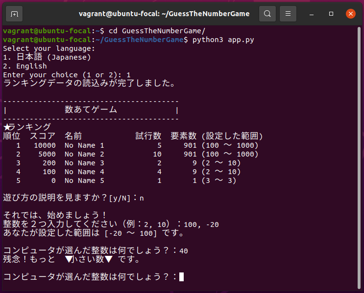
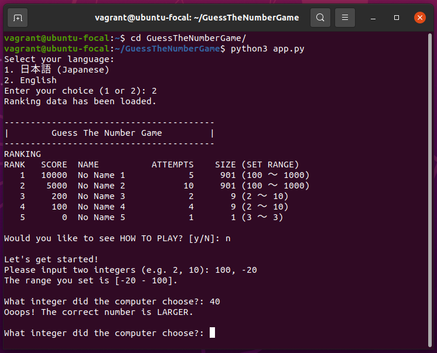

# 数あてゲーム / Guess The Number Game

## 目次 / Table of Contents
- [日本語 (Japanese)](#日本語-japanese)
- [English](#english)
- [補足情報 / Supplement](#補足情報--supplement)

---

## 日本語 (Japanese)


### ゲーム概要
数あてゲームは、プレイヤーが指定した整数の範囲から、コンピュータがランダムに選んだ数を当てるシンプルなゲームです。

### 特徴
- 任意の整数範囲を設定可能
- プレイ内容を基にしたスコア評価
- ハイスコアランキング機能付き
- ランキングデータは自動保存（ローカル環境に保存）
- 日本語・英語対応のメッセージ

### インストール手順
1. **Python3.8以上をインストール**:
   必要に応じて、公式サイトからPythonをダウンロード、インストールしてください。

2. **Gitがインストールされていることを確認**: ゲームをクローンするためにGitが必要です。インストールされていない場合は、公式サイトからGitをダウンロード、インストールしてください。

3. **リポジトリのクローン**:
   ターミナルを起動して、次のコマンドを実行して、ゲームを取得します。
    ```bash
    git clone https://github.com/akemashita/GuessTheNumberGame.git
    ```

4. **ファイルの実行**:
   次のコマンドを実行して、クローンしたフォルダに移動し、ゲームファイルを実行します。
    ```bash
    cd GuessTheNumberGame
    python3 app.py
    ```

### 遊び方
1. **言語の選択**:
   ゲーム開始時に言語選択画面が表示されます。選択がなければ日本語がデフォルトとなります。

2. **範囲の設定**:
   メッセージに従い、推測する整数範囲を設定します。（例: 2, 10）

3. **ゲームの進行**:
   - 画面に表示されるヒントをもとに数を推測します。
   - 推測が正解するまで続けます。

4. **ゲーム終了**:
   途中で終了したい場合は、`Ctrl + C` を押してください。

このゲームでは、二分探索の考え方を活用して効率よく正解を導き出すことが高スコアの鍵です！(｀・ω・´)
さらに、直感が冴えれば、驚くようなスコアも狙えます。
ぜひ挑戦して、最高のスコアを目指してください！(｡•̀ᴗ•́｡)


---

## English



### Game Overview
"Guess the Number" is a simple game where the player tries to guess a random number selected by the computer within a specified range.

### Features
- Set any integer range for guessing.
- Score evaluation based on gameplay.
- High score ranking feature.
- Ranking data is automatically saved (locally stored).
- Supports both Japanese and English messages.

### Installation Instructions

1. **Make sure Python 3.8 or later is installed**:
Download and install Python from the official website if needed.

2. **Make sure Git is installed**:
Git is needed to clone the game repository. If it's not installed, please download and install Git from the official website.

3. **Clone the repository**:
Open your terminal and execute the following command to obtain the game:

    ```bash
    git clone https://github.com/akemashita/GuessTheNumberGame.git
    ```

4. **Run the game**:
Move to the cloned folder and execute the game file with the following commands:

    ```bash
    cd GuessTheNumberGame
    python3 app.py
    ```

### How to Play
1. **Select a language**:
At the start of the game, a language selection screen will be displayed. If no selection is made, Japanese will be used by default.

2. **Set the range**:
Follow the messages to set the range of integers for guessing (e.g. 2, 10).

3. **Gameplay**:
- Guess the number based on the hints displayed on the screen.
- Continue guessing until you find the correct answer.

4. **End the game**:
To exit the game prematurely, press Ctrl + C.

In this game, using the strategy of binary search is the key to achieving a high score! 🤓
Plus, if your intuition is spot on, you might surprise yourself with an amazing score.
Take on the challenge and aim for the top score! 🌟


---

## 補足情報 / Supplement

### スコア評価 / Score Evaluation
- ゲームのスコアシステムに興味がある方は、こちらをご覧ください。
- If you're curious about how the scoring system works, check out the details below.

#### 計算式 / Formula
 - スコアは以下の式で算出されます: 
`スコア = (理想的な試行数 / 実際の試行数) × 倍率`
 - The score is calculated using the following formula:
`Score = (Ideal attempts / Actual attempts) × Multiplier`

#### 詳細 / Details
- **理想的な試行数 / Ideal attempts**:
   - `ceil(log2(要素数))`
   - この理想的な試行数は、範囲内の整数を二分探索で推測する際に必要な最小の試行回数です。具体的には、範囲に含まれる要素数に対して、理論的に最適な推測回数です。
   - `ceil(log2(Number of elements))`
   - This ideal attempts is the minimum number of attempts required to guess the integers in the range in a binary search. Specifically, it is the theoretically optimal number of guesses for the number of elements in the range.
- **要素数 / Number of elements**:
   - `設定範囲の終わりの数 - 設定範囲の初めの数 + 1`
   - `End of the range - Start of the range + 1`

#### 倍率 / Multiplier
倍率は要素数に基づいて次のように決まります / The multiplier is determined based on the number of elements in the range:
- 要素数が 1000 以上の場合 / For 1000 or more elements: **10,000**
- 要素数が 100 以上 1000 未満の場合 / For 100 to 999 elements: **5,000**
- 要素数が 50 以上 100 未満の場合 / For 50 to 99 elements: **2,500**
- 要素数が 50 未満の場合 / For fewer than 50 elements: **100**
